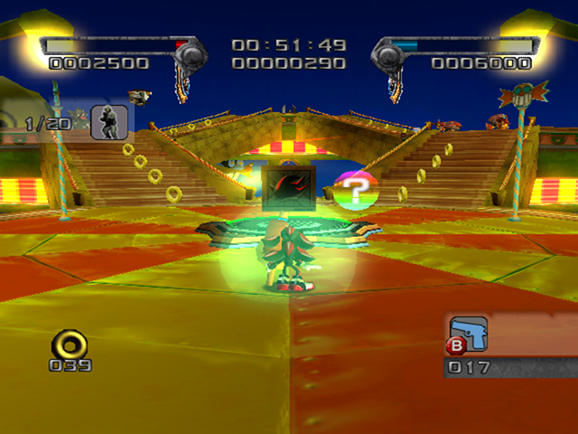

# Circus Park

<br />

## Next Stages in Story
|Dark|Normal|Hero|
|--|--|--|
|[Sky Troops](../SkyTroops)|[Mad Matrix](../MadMatrix)|[Death Ruins](../DeathRuins)|

<br />

## Level Layout
```
<Insert Level Map Here>
```

<br />

## Key Locations
|Key 1|Key 2|Key 3|Key 4|Key 5|
|--|--|--|--|--|
|[  ](../img/CircusPark/CircusPark-Key1.png)|[  ](../img/CircusPark/CircusPark-Key2.png)|[  ](../img/CircusPark/CircusPark-Key3.png)|[  ](../img/CircusPark/CircusPark-Key4.png)|[  ](../img/CircusPark/CircusPark-Key5.png)|

<br />

## Shadow Boxes
| |Box 1|Box 2|
|-|-|-|
|__Location__|[  ](../img/CircusPark/CircusPark-SpecialWeaponsContainer1.png)|[  ](../img/CircusPark/CircusPark-SpecialWeaponsContainer2.png)|
|__Default Weapon__|Assault Rifle|Heavy Machine Gun|

<br />

## Enemies in Stage

<br />

## Weapons Available

<br />

## Notes of Interest

### Hero Mission Routes
There are 2 main ways to completing the Hero Mission in this stage.  One involves the normal gathering of rings throughout the entire stage, and the other collects rings by abusing the checkpoints to reload the bell prize at the beginning of the stage.  Below is a video comparing the two.  One is ideal for IL attempts, where the goal is to get the lowest IGT, where the other is better for RTA focused runs.

<br />